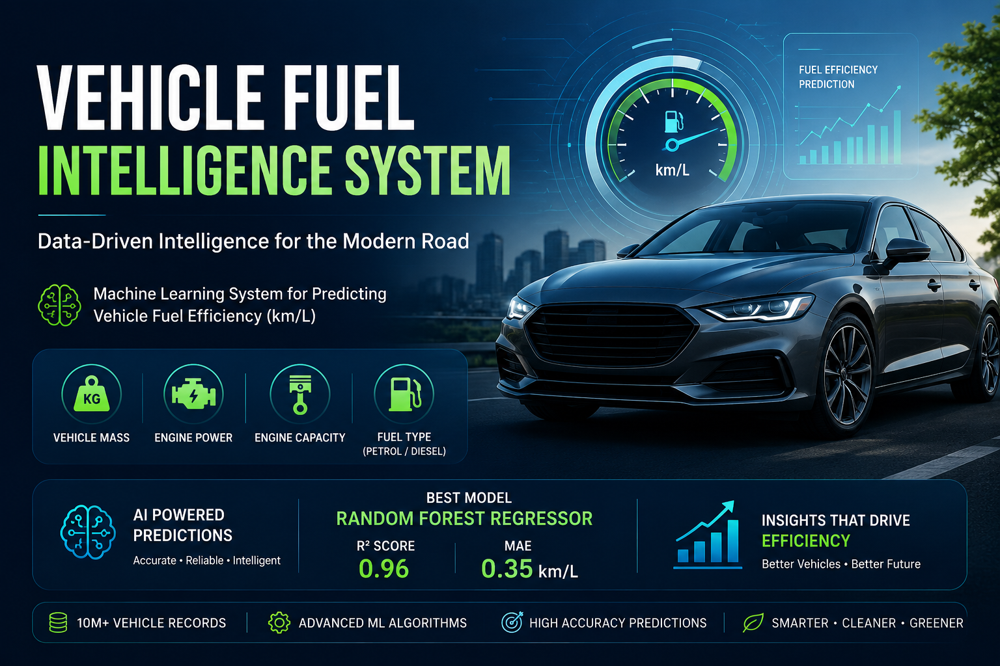

# 🚗 Vehicle Fuel Intelligence System

<p align="center">
  
</p>

<h3 align="center">
  Machine Learning-Based Vehicle Fuel Efficiency Prediction
</h3>

<p align="center">
  An end-to-end Machine Learning project that predicts vehicle fuel efficiency
  using automotive and engine parameters.
</p>

---

## 🚀 Project Highlights

| 🔧 Automotive Data | 🤖 Machine Learning | 📈 Performance |
|---|---|---|
| Vehicle & Engine Parameters | Random Forest Regression | **R² = 0.96** |
| Fuel Characteristics | Feature Engineering | **96% Explained Variance** |
| Fuel Efficiency Analysis | Hyperparameter Tuning | Production-ready Pipeline |

---

# 📌 Overview

Fuel efficiency is an important factor in vehicle performance, running cost, and energy consumption.

The **Vehicle Fuel Intelligence System** applies Machine Learning to automotive data to predict a vehicle's fuel efficiency in **km/L** based on vehicle and engine characteristics.

The project follows a complete Machine Learning workflow:

```text
Raw Vehicle Data
       ↓
Data Cleaning
       ↓
Exploratory Data Analysis
       ↓
Feature Engineering
       ↓
Encoding & Scaling
       ↓
Model Training
       ↓
Hyperparameter Tuning
       ↓
Model Evaluation
       ↓
Fuel Efficiency Prediction