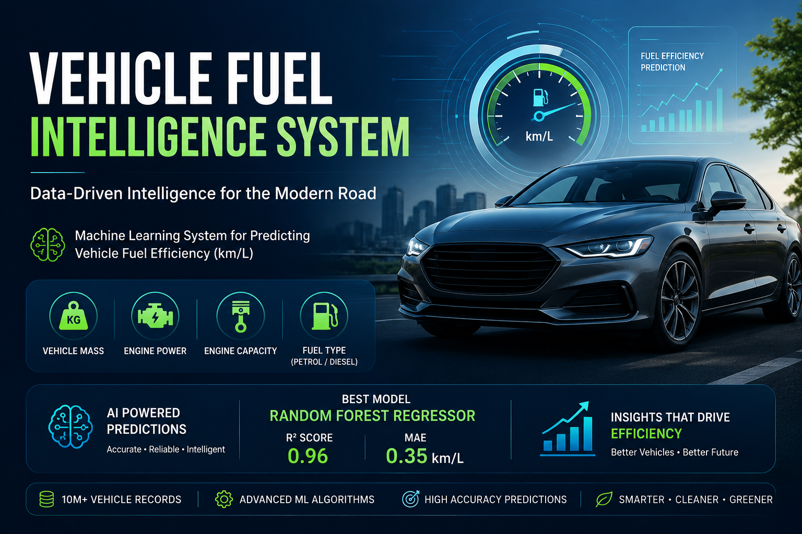
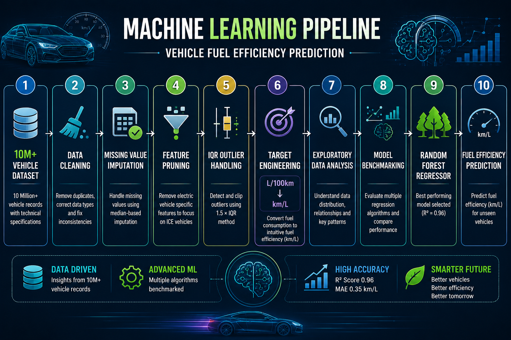
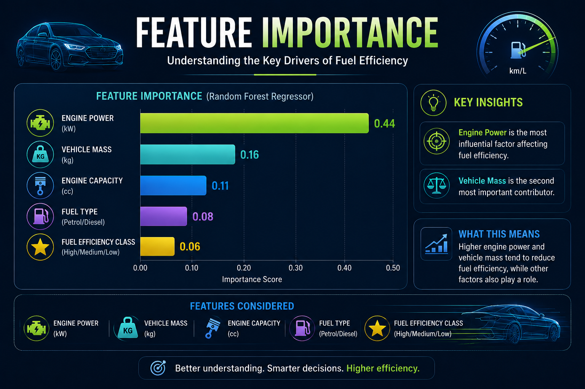
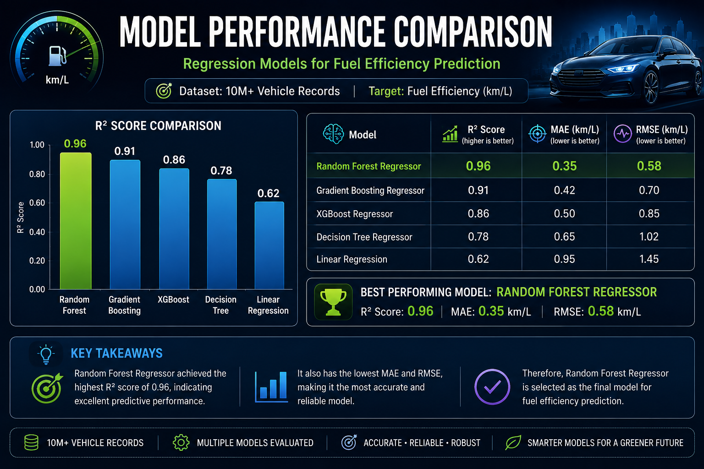
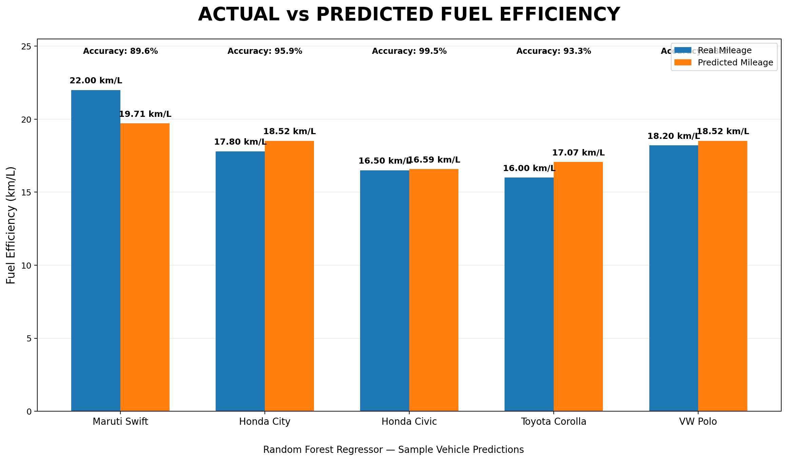
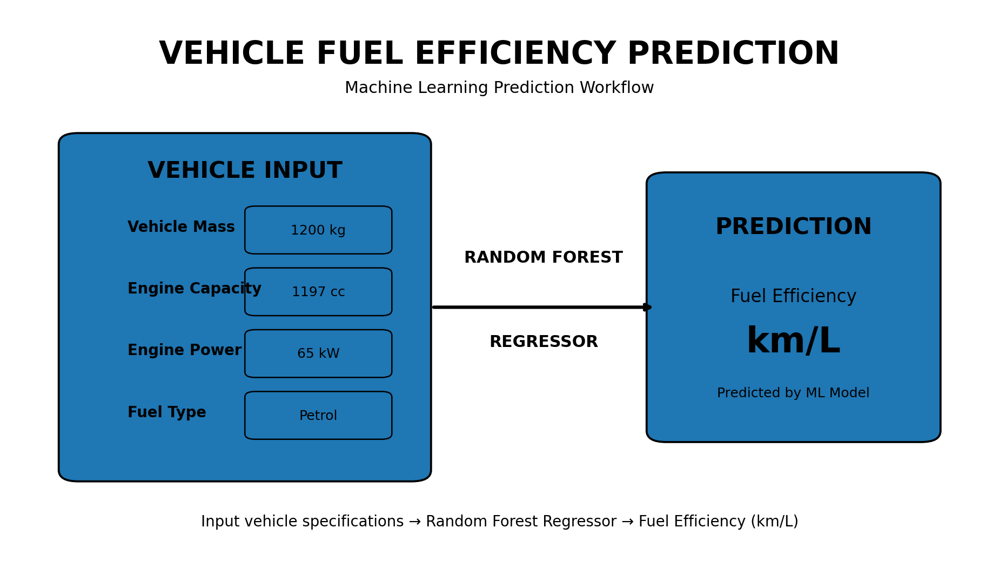

# 🚗 Vehicle Fuel Intelligence System

<p align="center">
  
</p>

<h3 align="center">
  Machine Learning-Based Vehicle Fuel Efficiency Prediction
</h3>

<p align="center">
  An end-to-end Machine Learning project that analyzes automotive and engine parameters
  to predict vehicle fuel efficiency in <b>km/L</b>.
</p>

<p align="center">
  
  
  
  
  
</p>

---

## 🚀 Project Highlights

| 🔧 Automotive Data          | 🤖 Machine Learning      | 📈 Performance             |
| --------------------------- | ------------------------ | -------------------------- |
| Vehicle & Engine Parameters | Random Forest Regression | **R² = 0.96**              |
| Fuel Characteristics        | Feature Engineering      | **96% Explained Variance** |
| Fuel Efficiency Analysis    | Hyperparameter Tuning    | End-to-End ML Pipeline     |

---

## 📌 Overview

Fuel efficiency is an important factor in vehicle performance, running cost, and energy consumption.

The **Vehicle Fuel Intelligence System** applies Machine Learning to automotive data to predict a vehicle's fuel efficiency in **km/L** based on vehicle, engine, fuel, and test-related parameters.

The project demonstrates a complete end-to-end Machine Learning workflow, from raw automotive data to model-based fuel-efficiency prediction.

### 🎯 Objective

The main objectives of this project are:

* Analyze large-scale automotive data
* Identify important factors affecting fuel efficiency
* Predict vehicle fuel efficiency in km/L
* Compare multiple Machine Learning regression algorithms
* Select and optimize the best-performing model
* Build a reusable prediction pipeline
* Demonstrate practical Machine Learning applications in the automotive domain

---

## 🔄 Machine Learning Workflow

```text
                    Raw Vehicle Data
                           │
                           ▼
                    Data Cleaning
                           │
                           ▼
                 Exploratory Data Analysis
                           │
                           ▼
                  Feature Engineering
                           │
                           ▼
                   Encoding & Scaling
                           │
                           ▼
                    Train/Test Split
                           │
                           ▼
                    Model Training
                           │
                           ▼
                 Hyperparameter Tuning
                           │
                           ▼
                    Model Evaluation
                           │
                           ▼
              Fuel Efficiency Prediction
                           │
                           ▼
                       km/L Output
```

### 🔄 Project Pipeline

<p align="center">
  
</p>

---

## 📊 Dataset

The project works with a large-scale automotive dataset containing **6.5M+ vehicle/test records**.

### Key Features

* Vehicle mass
* Test mass
* Engine power
* Engine capacity
* Fuel type
* Fuel consumption
* Vehicle-related parameters
* Test-related parameters

### 🎯 Target Variable

**Fuel Efficiency — km/L**

The target variable represents the vehicle's predicted fuel efficiency.

---

## 🧹 Data Preprocessing

The raw automotive dataset was processed through multiple stages:

* Missing-value analysis and handling
* Duplicate analysis
* Data type validation
* Outlier analysis
* Feature selection
* Feature engineering
* Categorical encoding
* Numerical preprocessing
* Train/test split

Special attention was given to identifying and reducing potential **data leakage** during model development.

---

## 🔍 Exploratory Data Analysis

Exploratory Data Analysis was performed to understand:

* Fuel-efficiency distribution
* Relationship between engine characteristics and fuel efficiency
* Vehicle mass relationships
* Fuel-type behavior
* Feature correlations
* Important variables influencing prediction

---

## 🧠 Feature Engineering

Feature engineering was used to transform automotive parameters into meaningful Machine Learning features.

The project analyzes relationships between:

```text
Vehicle Characteristics
          +
Engine Characteristics
          +
Fuel Characteristics
          +
Test Parameters
          │
          ▼
Fuel Efficiency Prediction
```

Feature relationships and correlations were analyzed before selecting the final model inputs.

---

## 🤖 Machine Learning Models

Multiple regression algorithms were evaluated:

| Model               | Purpose                           |
| ------------------- | --------------------------------- |
| Linear Regression   | Baseline regression model         |
| Decision Tree       | Non-linear relationship modelling |
| K-Nearest Neighbors | Similarity-based prediction       |
| Random Forest       | Ensemble-based prediction         |
| XGBoost             | Gradient boosting comparison      |

After model comparison and tuning, **Random Forest Regression** achieved the strongest overall performance for the selected feature configuration.

---

## 🌳 Feature Importance

Feature importance analysis was performed using the trained Random Forest model to understand which automotive parameters contributed most to the prediction.

<p align="center">
  
</p>

---

## 🏆 Model Performance

The final Random Forest model achieved approximately:

```text
R² Score
0.96

Explained Variance
96%

Dataset Size
6.5M+ records
```

<p align="center">
  
</p>

### Why Random Forest?

Random Forest was selected because it can effectively model:

* Non-linear relationships
* Complex feature interactions
* Automotive parameter relationships
* Different feature contributions

It also provides feature-importance information that helps interpret the model.

---

## 📈 Actual vs Predicted

The actual-vs-predicted analysis was used to evaluate how closely the model's predictions matched the observed fuel-efficiency values.

<p align="center">
  
</p>

---

## 🖥️ Prediction Demo

The trained Machine Learning model can be used to generate fuel-efficiency predictions based on vehicle and engine parameters.

<p align="center">
  
</p>

---

## 🏗️ Project Architecture

```text
VEHICLE FUEL INTELLIGENCE SYSTEM
│
├── data/
│   └── Automotive Dataset
│
├── demo/
│   └── Prediction Demo
│
├── images/
│   ├── banner.png
│   ├── pipeline.png
│   ├── feature-importance.png
│   ├── model-performance.png
│   ├── actual-vs-predicted.png
│   └── prediction-demo.png
│
├── models/
│   └── Trained Model
│
├── notebooks/
│   ├── Data Analysis
│   ├── EDA
│   ├── Feature Engineering
│   └── Model Development
│
├── src/
│   └── Machine Learning Source Code
│
├── app.py
├── requirements.txt
├── .gitignore
└── README.md
```

---

## 🛠️ Tech Stack

### Programming

* Python

### Data Processing

* Pandas
* NumPy

### Data Visualization

* Matplotlib
* Seaborn

### Machine Learning

* Scikit-learn
* Linear Regression
* Decision Tree
* KNN
* Random Forest
* XGBoost

### Development Tools

* Jupyter Notebook
* VS Code
* Git
* GitHub

---

## ⚙️ Installation

### 1. Clone the Repository

```bash
git clone https://github.com/mohanraj-Ai/Vehicle-Fuel-Efficiency-System.git
```

### 2. Navigate to the Project

```bash
cd Vehicle-Fuel-Efficiency-System
```

### 3. Install Dependencies

```bash
pip install -r requirements.txt
```

---

## ▶️ Running the Application

Run the application using:

```bash
python app.py
```

Provide the required vehicle and engine parameters to generate the predicted fuel efficiency.

---

## 📂 Repository Structure

```text
Vehicle-Fuel-Intelligence-System/
│
├── data/
├── demo/
├── images/
├── models/
├── notebooks/
├── src/
│
├── app.py
├── requirements.txt
├── .gitignore
└── README.md
```

---

## 📌 Key Learnings

This project provided practical experience in:

* Large-scale automotive data processing
* Exploratory Data Analysis
* Feature engineering
* Regression modelling
* Ensemble Machine Learning
* Hyperparameter tuning
* Model evaluation
* Data leakage prevention
* Feature importance analysis
* Building an end-to-end ML pipeline
* Applying Machine Learning to automotive engineering problems

---

## 💡 Real-World Applications

The Vehicle Fuel Intelligence System can support:

* 🚗 Vehicle performance analysis
* ⛽ Fuel-efficiency estimation
* 💰 Fuel-cost estimation
* 🚚 Fleet efficiency monitoring
* 🔧 Automotive engineering analysis
* 📊 Vehicle comparison
* 📈 Predictive automotive analytics
* ⚙️ Fuel-efficiency optimization

---

## 🔮 Future Improvements

The project can be extended with:

* ⚡ Real-time vehicle telemetry integration
* 📱 Interactive web-based prediction dashboard
* 🚘 Electric Vehicle efficiency prediction
* 🔋 Battery and range prediction
* ☁️ Cloud-based ML deployment
* 🔄 Automated model retraining
* 📊 Real-time fleet analytics
* 🤖 Generative AI-based automotive insights
* 📡 IoT-based vehicle data integration

---

## 🎯 Project Outcome

This project demonstrates how Machine Learning can be applied to a large-scale automotive dataset to transform raw vehicle and engine information into meaningful **fuel-efficiency predictions**.

The final workflow combines:

```text
Large-Scale Automotive Data
          ↓
Data Engineering
          ↓
Machine Learning
          ↓
Model Evaluation
          ↓
Fuel Efficiency Intelligence
```

---

## 👨‍💻 Author

### Mohanraj P

**Generative AI Engineer | AI/ML Engineer | Automotive AI**

📍 Tamil Nadu, India

<p align="center">
  <a href="https://github.com/mohanraj-Ai">
    GitHub
  </a>
  &nbsp; • &nbsp;
  <a href="https://linkedin.com/in/mohan-raj-p-2bb994217">
    LinkedIn
  </a>
</p>

---

## ⭐ Support

If you find this project useful or interesting, consider giving the repository a ⭐ on GitHub.

Feedback and suggestions are welcome.

---

<p align="center">
  <b>🚗 Turning Automotive Data into Intelligent Fuel Insights</b>
</p>
